# Trap Talk AI - Design System & Aesthetic Specification

This document defines the design language, color palette, layout topology, typography, and component specifications for **Trap Talk AI**. The design is inspired by high-fidelity cyber-defense dashboards, retro-futuristic Sci-Fi HUDs (Heads-Up Displays), and command-line tactical terminals (modeled after *SANKATE_OS*).

---

## 1. Visual Style & Brand Identity

The aesthetic of **Trap Talk AI** is defined by **Cyber-Tactical Minimalism**. It is clean, functional, high-contrast, and text-dense. It evokes the feeling of a military or intelligence-grade operations console rather than a generic consumer application.

Key design pillars:
*   **Terminal Authenticity**: Monospaced typefaces, commands, uppercase headers, and dynamic status readouts.
*   **High-Contrast Dark Mode**: A pitch-black base allows neon overlays, glowing panels, and status alerts to pop dramatically.
*   **Tactical Hardware Details**: Bracket borders, subtle grid overlays, scanlines, and status lights make the software feel like it is running on dedicated hardware.

---

## 2. Color Palette

The color system uses high-saturation neon accents against deep, low-luminance backgrounds. The primary status cues are mapped to semantic colors to guide the user's attention.

```mermaid
gantt
    title Color Palette Breakdown
    dateFormat  X
    axisFormat %s
    section Backgrounds
    Pure Black (#000000)             :active, 0, 10
    Console Charcoal (#050805)       :active, 0, 10
    section Primary Accents
    Matrix/Neon Green (#00FF33)      :crit, 0, 10
    Terminal Olive (#1a331e)         :0, 10
    section State/Semantic
    Alert Red (#FF3333)              :active, 0, 10
    Selection Cyan (#00E5FF)         :active, 0, 10
    Muted Amber/Warning (#FFB300)    :active, 0, 10
```



### Color Variables (CSS Custom Properties)

```css
:root {
  /* Backgrounds */
  --bg-primary: #000000;
  --bg-secondary: #050805;
  --bg-panel: rgba(5, 8, 5, 0.75);
  --bg-panel-header: rgba(0, 255, 51, 0.05);

  /* Accents & Borders */
  --accent-neon-green: #00ff33;
  --accent-glow-green: rgba(0, 255, 51, 0.4);
  --accent-muted-green: #1a6b28;
  --accent-dark-green: #08210d;
  
  /* State Colors */
  --state-alert-red: #ff3333;
  --state-alert-glow: rgba(255, 51, 51, 0.3);
  --state-active-cyan: #00e5ff;
  --state-active-glow: rgba(0, 229, 255, 0.3);
  --state-warning-amber: #ffb300;

  /* Typography Colors */
  --text-primary: #00ff33;
  --text-secondary: #a3e2ad;
  --text-muted: #4e8056;
  --text-white: #ffffff;
  --text-dark: #001202;

  /* Grid & UI Effects */
  --grid-line-color: rgba(0, 255, 51, 0.03);
  --grid-subline-color: rgba(0, 255, 51, 0.015);
}
```

---

## 3. Typography

Fonts must feel technical and structured. We pair a high-tech geometric sans-serif for primary headings with a highly legible monospace font for logs, shell interactions, and parameters.

*   **Primary Display Font (Headers, Titles)**: **Orbitron** or **Share Tech Mono** (Google Fonts)
*   **Body & System Font (Logs, Code, UI Values)**: **JetBrains Mono**, **Fira Code**, or **SF Mono**
*   **Fallback Font Stack**: `ui-monospace, SFMono-Regular, Menlo, Monaco, Consolas, "Liberation Mono", "Courier New", monospace`

### Typography Scale

*   `h1` (Main titles): `2rem`, uppercase, bold, tracking `0.15em`, neon text-shadow.
*   `h2` (Section headers): `1.25rem`, uppercase, tracking `0.1em`, thin border bottom.
*   `h3` (Component labels): `1rem`, uppercase, tracking `0.05em`.
*   `body` (Log feed, main chat): `0.9rem`, line-height `1.5`, regular weights.
*   `small` (Status parameters, timestamps): `0.75rem`, letter-spacing `0.05em`, color `--text-muted`.

---

## 4. Layout & Grid Topology

The interface utilizes a rigid, screen-filling layout (100vh / 100vw) that avoids vertical scrolling of the entire page. Instead, individual panels have scrollable viewports.

### System HUD Architecture

```
+---------------------------------------------------------------------------------------+
|  LOGO // TRAP_TALK_AI [ONLINE]     IP: 192.168.1.105    THREAT: LOW    STATUS: ACTIVE  |
+---------------------------------------------------------------------------------------+
|              |                                                      |                 |
|  DIAGNOSTICS |  NEURAL LINK CHAT INTERFACE                           |  RESOURCES &    |
|  & METRICS   |                                                      |  ARTIFACTS      |
|              |  +-------------------------------------------------+ |                 |
|  [OODA Loop] |  | Chat messages stream...                         | |  [Scan status]  |
|              |  |                                                 | |                 |
|  [System log |  |                                                 | |  [CPU load]     |
|   live feed] |  +-------------------------------------------------+ |  [Memory alloc] |
|              |  | > Input payload command...                    [>] | |                 |
|              |  +-------------------------------------------------+ |                 |
|              |                                                      |                 |
+---------------------------------------------------------------------------------------+
```

### Grid Canvas Background
To achieve the classic retro screen grids, a CSS linear-gradient background is used.

```css
.hud-canvas {
  background-color: var(--bg-primary);
  background-image: 
    linear-gradient(var(--grid-line-color) 1px, transparent 1px),
    linear-gradient(90deg, var(--grid-line-color) 1px, transparent 1px),
    linear-gradient(var(--grid-subline-color) 0.5px, transparent 0.5px),
    linear-gradient(90deg, var(--grid-subline-color) 0.5px, transparent 0.5px);
  background-size: 100px 100px, 100px 100px, 20px 20px, 20px 20px;
  position: relative;
  overflow: hidden;
}
```

---

## 5. Component Style Specifications

### A. HUD Panels (The Console Windows)
Every panel must have a header bar, a thin outline, and optional bracket accents.

*   **Border Styling**: Thin solid lines (`1px solid var(--accent-muted-green)`).
*   **Panel Header**: Semi-transparent green background, uppercase tag, and alignment indicators.
*   **Glow Effect**: A subtle green drop shadow or box shadow to emphasize active panels.

```css
.hud-panel {
  background: var(--bg-panel);
  border: 1px solid var(--accent-muted-green);
  border-radius: 2px;
  display: flex;
  flex-direction: column;
  box-shadow: 0 0 15px rgba(0, 255, 51, 0.05);
}

.hud-panel-header {
  background: var(--bg-panel-header);
  border-bottom: 1px solid var(--accent-muted-green);
  padding: 8px 12px;
  font-family: 'Share Tech Mono', monospace;
  font-size: 0.85rem;
  color: var(--text-primary);
  display: flex;
  justify-content: space-between;
  align-items: center;
}
```

### B. Interactive Buttons
Buttons must look like machine interfaces. They are outlined, reactive, and feature corner brackets.

*   **Idle**: Muted green border, green text, no background.
*   **Hover**: Bright neon green background, black text, strong box glow.
*   **Corners**: Bracket accents (`[+ START_NEW_SESSION ]`).

```css
.hud-button {
  background: transparent;
  border: 1px solid var(--text-primary);
  color: var(--text-primary);
  font-family: 'Share Tech Mono', monospace;
  font-weight: bold;
  padding: 10px 20px;
  text-transform: uppercase;
  cursor: pointer;
  position: relative;
  transition: all 0.2s ease-in-out;
}

.hud-button:hover {
  background: var(--accent-neon-green);
  color: var(--text-dark);
  box-shadow: 0 0 15px var(--accent-glow-green);
}

/* Bracket corners */
.hud-button::before, .hud-button::after {
  content: '';
  position: absolute;
  width: 4px;
  height: 4px;
  border-color: var(--accent-neon-green);
  border-style: solid;
}
/* Top Left */
.hud-button::before {
  top: -1px;
  left: -1px;
  border-width: 1px 0 0 1px;
}
/* Bottom Right */
.hud-button::after {
  bottom: -1px;
  right: -1px;
  border-width: 0 1px 1px 0;
}
```

### C. System Resource Indicators & Progress Bars
Progress bars must feel segmented or retro-filled.

*   **CPU / Memory Indicators**: Continuous solid fill with a glowing head, or a series of segmented blocks (`|||||||||||||||......`).

```css
.resource-bar-container {
  width: 100%;
  height: 8px;
  background: var(--accent-dark-green);
  border: 1px solid var(--accent-muted-green);
  position: relative;
}

.resource-bar-fill {
  height: 100%;
  background: var(--accent-neon-green);
  box-shadow: 0 0 8px var(--accent-glow-green);
  width: 75%; /* Dynamic */
  transition: width 0.4s cubic-bezier(0.1, 0.8, 0.2, 1);
}
```

### D. Chat Terminal Input
The core dialogue interaction window.

*   Input prefix: Contains a bright caret indicator (`> ` or `>> `).
*   Form factor: Dark text field that has no native OS borders, only the HUD outline.
*   Blinking Cursor: The blinking caret `_` at the end of the user's active cursor.

```css
.terminal-input-wrapper {
  display: flex;
  align-items: center;
  border: 1px solid var(--accent-muted-green);
  background: var(--bg-primary);
  padding: 10px 15px;
}

.terminal-prefix {
  color: var(--accent-neon-green);
  margin-right: 10px;
  font-family: 'Share Tech Mono', monospace;
  font-weight: bold;
}

.terminal-input {
  background: transparent;
  border: none;
  outline: none;
  color: var(--text-primary);
  font-family: 'JetBrains Mono', monospace;
  font-size: 0.95rem;
  flex-grow: 1;
}
```

---

## 6. Micro-interactions & CRT Effects

To elevate this to a "wow-factor" experience, we specify subtle screen-wide visual effects.

### A. CRT Screen Scanline Overlay
An absolute-positioned layer covering the viewport with a repeating linear-gradient to simulate old cathode-ray tube scans.

```css
.crt-effect::after {
  content: " ";
  display: block;
  position: absolute;
  top: 0; left: 0; bottom: 0; right: 0;
  background: linear-gradient(rgba(18, 16, 16, 0) 50%, rgba(0, 0, 0, 0.25) 50%), linear-gradient(90deg, rgba(255, 0, 0, 0.06), rgba(0, 255, 0, 0.02), rgba(0, 0, 255, 0.06));
  aspect-ratio: 16/9;
  background-size: 100% 2px, 3px 100%;
  pointer-events: none;
  z-index: 9999;
}
```

### B. Caret Blink Keyframes
For command entries and processing loaders.

```css
@keyframes blink {
  0%, 100% { opacity: 1; }
  50% { opacity: 0; }
}

.caret-blink {
  animation: blink 1s step-end infinite;
}
```

---

## 7. Next Steps for Trap Talk AI

To bring this design to life:
1.  **Framework Setup**: Initialize a Vite project with React or vanilla JavaScript.
2.  **Global Styles**: Create an `index.css` incorporating the CSS variables and base component definitions from this document.
3.  **UI Layout**: Construct the three-column HUD skeleton.
4.  **Terminal Simulation**: Build a custom hook to handle logs auto-scrolling, typewriter effects for incoming bot messages, and dynamic CPU/Memory values that fluctuate slightly to simulate background activities.
